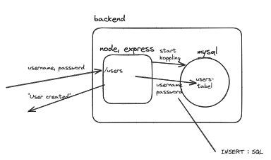

# mysql2-crud

- Forked from: git@github.com:chasacademy-sandra-larsson/mysql2-crud.git
- Inspelning:
  - https://us06web.zoom.us/rec/share/qa0NHcMnsxnlMqNJexPH5pbfGj2FBr5QBGM5M6wHl6Yxr00JPWIxHBxPw2VVrXe6.wIJkWItSF9wJ5eZu%20%20
  - Lösen: sW8Su\*@i
  - Skapa en databas "banksajt" i myPHPadmin vid ca 01:50
    

## Dagens uppgift del 1

1. Installera MAMP - vi väljer MAMP för att det passar
   både och Windows (blir samma vy)
   Vi använder MySQL som lokal databas.
   Vi ska inte fortsätta i detta utan använd Prisma och PostgreSQL nästa vecka.

2. Titta in i databashanteraren phpMyAdmin
   och skapa vår databas och tabeller

3. Installera en databasdriver mysql2 på npm (https://www.npmjs.com/package/mysql2) och skapa uppkopplingtill vår lokala mysql-db genom den

4. Använda SQL-anrop i vår kod genom mysql2

## Dagens uppgift del 2

### 1. MySql CRUD med användarnamn och lösenord



### 2. Inloggning och skapa användare med DB

1. Gör INSERT med krypterat lösenord. (INSERT)

2. Göra login där vi kollar om användare finns i DB (SELECT)

3. Uppdatera lösenord (UPDATE)

4. Ta bord användare (DELETE)

## Köra

1.  Starta programmet MAMP
2.  Installera Nodemon:
    ```
    npm i -g nodemon - -save -dev
    ```
3.  Installera mySQL2:

    ```
    Install: npm install --save mysql2
    Install (TypeScript): npm install --save-dev @types/node
    ```

4.  lägg in en user i body i Thunder Client:
    ```
    {
    "username": "sandra",
    "password": "hemligt"
    }
    ```
5.  Kör POST på localhost:3000/users i thunderclient
    eller POST på localhost:3000/login för att se om användare loggas in
6.  Run:
    ```
    nodemon server.js
    ```
7.  Klicka på SEND i Thunder Client
8.  Kolla att user lades till i MAMP/phpMyAdmin
9.  Byta lösen:
    1. Lägg in ett liknande object i body i Tunder Client:
       ```
       {
       "username": "Linus",
       "oldPassword": "hemligt",
       "newPassword": "nytt-lösen"
       }
       ```
    2. Kolla i myPHPadmin att lösen uppdaterades.

## Länkar

- Excalidraw: https://app.excalidraw.com/l/9THk15pMa6N/2hDz4uPoLMo
- Föreläsning:
  - https://us06web.zoom.us/rec/share/qa0NHcMnsxnlMqNJexPH5pbfGj2FBr5QBGM5M6wHl6Yxr00JPWIxHBxPw2VVrXe6.wIJkWItSF9wJ5eZu%20%20
  - Lösenkod: sW8Su\*@i
